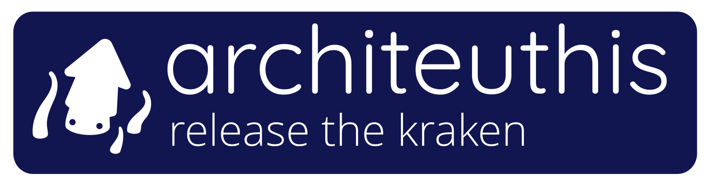

[](https://github.com/cdiener/architeuthis/actions/workflows/go.yml)

> *architeuthis* is named after *Architeuthis dux*, the giant squid. It also sounds
> like "archi-do-this", so giving instructions to your pet kraken.

*architeuthis* is a fast standalone command to supplement the Kraken suite of software tools
such like Kraken2, KrakenUniq, and Bracken. I saw myself repeatedly rewriting the same
code in my pipelines when dealing with Kraken output, like merging files or maninpulating
lineage annotations. It also adds some functionality to dive deeper into the individual
k-mer classifications for reads.

*This is currently in an alpha state.*

## Usage

```
Usage:
  architeuthis [command]

Available Commands:
  completion  Generate the autocompletion script for the specified shell
  help        Help about any command
  lineage     Add lineage information to Bracken output.
  mapping     Analyze read and k-mer level mapping.
  merge       Merge various output files related to Kraken.

Flags:
      --db string   path to the Kraken database [optional]
  -h, --help        help for architeuthis
```
